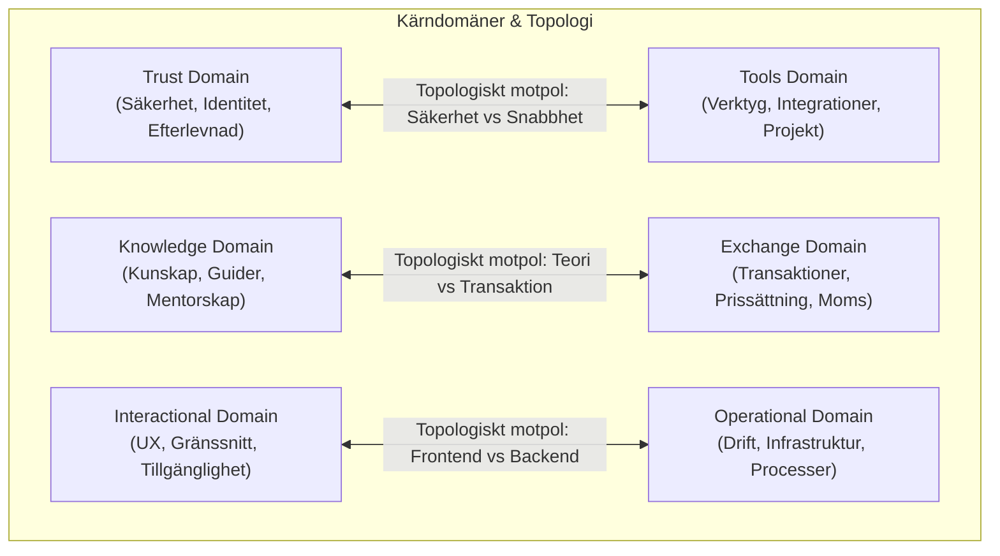
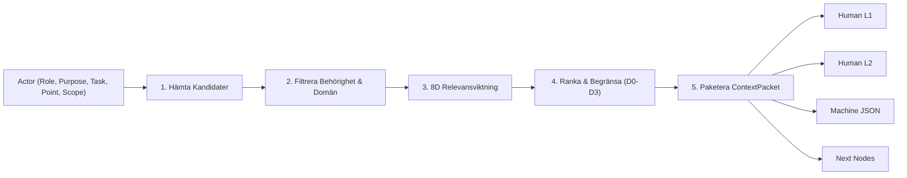

# Referensguide: Dynamisk Kontextmotor & Domänarkitektur

Denna referens dokumenterar den fullständiga arkitekturen för den dynamiska kontextmotorn och domänlagren i Omnipod/Omniframez.

---

## 1. De 9 Perspektivfönstren (Perspective Windows)

Perspektivfönstren fungerar som observations- och tolkningslinser för användare och agenter:

| Fönster | Namn | Primär Fokus | Input | Output |
| :--- | :--- | :--- | :--- | :--- |
| **W1** | **Kontextualisering** | Behov, trender, förutsättningar | Marknadssignaler, interna mål | Möjligheter & kontextuella insikter |
| **W2** | **Matchning** | Resurs- & kompetensmatchning | Behovsbeskrivning, profilkatalog | Matchningar & allokeringsförslag |
| **W3** | **Utvärdering** | Prestation, feedback, måluppfyllnad | Loggar, KPI-utfall, enkäter | Utvärderingsrapporter & förbättringsförslag |
| **W4** | **Resursallokering** | Budget, tid och fysiska resurser | Projektplaner, tillgänglighet | Allokeringsplaner & beläggningsgrad |
| **W5** | **Finansiell Hantering**| Bokföring, moms, VMB, transaktioner | Verifikationer, fakturor, bank | Balansrapporter, skattedeklarationer |
| **W6** | **Personalhantering** | Roller, mandat, välmående, kompetens | Teamdata, tidsrapporter, feedback | Teamstruktur & rollprofiler |
| **W7** | **Kommunikation & Visning** | Informationsflöden, realtidsvyer | Agentresultat, beslutshändelser | Dashboards, notiser, loggar |
| **W8** | **Innovation & Teknik** | Piloter, experiment, tech-scouting | Idéer, externa innovationer | Experimentplaner & teknikrekommendationer |
| **W9** | **Adaptiva Insikter** | Djupa mönster, sentiment, rotorsaker | Systemövergripande telemetri | Prediktiva insikter & meta-rekommendationer |

---

## 2. De 6 Funktionella Domänerna & Topologiska Avstånd

Domäner representerar ontologiska verklighetsområden med definierade semantiska avstånd:

### Katalogstruktur:
- `/trust`: Säkerhetspolicyer, granskningsloggar, behörighetslistor, trust-scores.
- `/knowledge`: Guider, procedurer, arkitekturritningar, kurser, bästa praxis.
- `/data`: Datamängder, scheman, metadata, API-definitioner.
- `/operational`: Driftloggar, processflödeskartor, telemetri, integrationsstatus.

---

## 3. Dynamic Context Resolution Engine (5-Stegs Pipelinen)

Pipelinen tar ett brett datalager och extraherar en exakt, tillåten och uppgiftsanpassad delgraf.

### 8-Dimensionella Viktningsmodellen:
Den totala relevansen $S$ för varje nod $n$ beräknas som en viktad summa:
$$S(n) = \sum_{i=1}^{8} w_i \cdot s_i(n)$$

1. **Uppgiftsrelevans ($s_1$)**: Semantisk likhet mellan nodens innehåll och aktuell uppgift.
2. **Topologiskt Avstånd ($s_2$)**: Avstånd i hopp från målnoden ($D_0=1.0, D_1=0.8, D_2=0.5, D_3=0.2$).
3. **Aktualitet ($s_3$)**: Tidsmässig färskhet och halveringstid för informationen.
4. **Rollmatchning ($s_4$)**: Hur väl noden matchar rollens primära ansvarsområde.
5. **Domänkompatibilitet ($s_5$)**: Matchning mot tillåtna funktionella domäner.
6. **Datakvalitet ($s_6$)**: Verifieringsgrad, evidensstyrka och datakällans tillförlitlighet.
7. **Behörighet ($s_7$)**: Säkerhetsklarering och rollaccess (0.0 om otillåten).
8. **Känslighetsfilter ($s_8$)**: Skydd mot otillbörlig spridning av sekretessbelagd information.

---

## 4. Multi-Tier Presentation (Vyer)

Ett genererat `ContextPacket` projiceras alltid i fyra separata format:

1. **Human View L1 (Executive Summary)**:
   Kompakt 2-3 meningars sammanfattning anpassad för snabb kognitiv absorbering.
2. **Human View L2 (In-Depth Narrative)**:
   Fullständigt narrativ med bakgrund, identifierade kopplingar, underliggande evidens och riskfaktorer.
3. **Machine View (Structured JSON)**:
   Maskinlänkningsbar representation med typade noder, relationer, förtroendepoäng och metadata för efterföljande agenter.
4. **Navigation View (Recommended Next Nodes)**:
   De högst rankade relaterade noderna att utforska om ytterligare fördjupning krävs, inklusive rekommenderad expansionsriktning ($D_n \rightarrow D_{n+1}$).

---

## 5. Rollbehörigheter & Fönsterstyrning

Motorn stöder dynamisk resolution baserat på standardiserade roller samt explicit fönsterstyrning:

| Roll | Tillåtna Domäner | Standardfönster | Typiskt Användningsområde |
| :--- | :--- | :--- | :--- |
| **Data Manager** | Operational, Tools, Trust, Exchange | W4 / W5 | Flaskhalsanalys, datakvalitet, processer |
| **Innovationsledare** | Tools, Operational, Knowledge, Exchange | W8_INNOVATION_TECH | AI-piloter, ny teknik, IoT-telemetri |
| **Affärsutvecklare** | Exchange, Interactional, Tools, Operational | W2_MATCHING | Kommersiella abonnemang, kundsegmentering |
| **Strategisk Ledare** | Trust, Knowledge, Operational, Exchange | W1_CONTEXTUALIZATION | Ekosystemstrategi, långsiktig konvergens |
| **CFO / Ekonomi** | Operational, Exchange, Trust, Knowledge, Tools| W5_FINANCIAL_MANAGEMENT | Bokslut, VMB, momsdeklaration |

*Överstyrning:* Parametern `window` i `ContextResolver.resolve_context(..., window=...)` möjliggör för agenter att rikta blicken mot valfritt perspektivfönster oberoende av basrollen.

