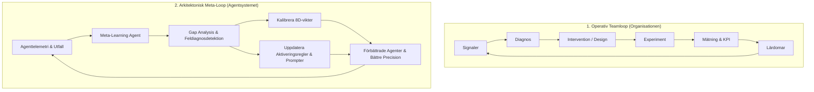

# Referensguide: 12-Agent Systemet, Specialister & Meta-Lärande

Denna referens specificerar agenternas roller, det gemensamma kontraktet och de dubbla feedbacklooparna för teamoptimering.

---

## 1. De 12 Kärnagenterna i Loopen

| # | Agent | Kärnfråga | Input | Primär Output |
| :--- | :--- | :--- | :--- | :--- |
| **1** | **Observer** | *Vad händer i teamet just nu?* | Telemetri, loggar, händelser | Objektiv nulägesbild & signaler |
| **2** | **Diagnostiker** | *Varför händer det?* | Nulägesbild, avvikelser | Hypoteser & identifierade rotorsaker |
| **3** | **Team Architect** | *Hur bör teamet vara utformat?* | Diagnos, mål | Strukturförslag, rollmandat, scenarier |
| **4** | **Role Transition** | *Hur tar vi oss dit från nuläget?* | Förändringsbehov, struktur | Övergångsplan & kommunikationsstöd |
| **5** | **Collaboration** | *Hur kan vi samarbeta bättre?* | Teamstruktur, flaskhalsar | Samarbetsinterventioner & verktygsflöden |
| **6** | **Wellbeing** | *Hur mår teamet och vad behövs?* | Belastningssignaler, timmar | Välmående-åtgärder, hållbarhetsskydd |
| **7** | **AI Ethics** | *Är AI-användningen säker & etisk?* | Modeller, beslutsprocesser | Safeguards, bias-granskning, guardrails |
| **8** | **Experiment Agent** | *Hur testar vi hypotesen säkert?* | Åtgärdsförslag, hypotes | Tidsbegränsad experimentplan & metriker |
| **9** | **Measurement** | *Vad blev det faktiska resultatet?* | Experimentdata, baseline | Utfallsanalys & kvantifierat delta ($\Delta$) |
| **10**| **Learning** | *Vad har organisationen lärt sig?* | Utfallsanalys, framgång/misslyckande | Lärdomsobjekt & uppdaterade regler |
| **11**| **Orchestrator** | *Vad ska göras härnäst?* | Samtliga agentresultat | Nästa steg, schemaläggning, prioritering |
| **12**| **Meta-Learning** | *Hur kan agentsystemet bli bättre?* | All agenttelemetri, avvikelser | Regelkalibrering, uppdaterade vikter |

---

## 2. De 4 Utökade Informationsspecialisterna

Dessa specialister kopplas in av Orchestratorn eller Context Resolvern när djupare semantisk förståelse krävs:

1. **Semantic Mapper**:
   Översätter löpande text och begrepp till typade noder och relationer i kunskapsgrafen (`Ord → Begrepp → Objekt → Relation → Betydelse`).
2. **Provenance & Evidence Agent**:
   Spårar och validerar evidenskedjor (`Observation → Källa → Evidens → Tolkning → Slutsats`) och tilldelar verifierbara konfidenspoäng.
3. **Relationship Analyst**:
   Upptäcker latenta kopplingar och dolda beroenden mellan noder (`causes`, `depends_on`, `conflicts_with`, `blocks`, `enables`).
4. **Decision Architect**:
   Omvandlar insikter till strukturerade beslutsunderlag med explicita alternativ, trade-offs, risker och ägarskap.

---

## 3. Det Gemensamma Agentkontraktet: `AgentResult`

Varje agent måste returnera en instans av `AgentResult`:

```json
{
  "agent_name": "DiagnosticianAgent",
  "iteration": 1,
  "confidence": 0.88,
  "observations": [
    "Beslutstid för kundgodkännande har ökat från 2 till 11 dagar.",
    "Två roller hävdar parallellt mandat för samma process."
  ],
  "identified_issues": [
    "Otydlig mandatgräns mellan Roll A och Roll B."
  ],
  "hypotheses": [
    "Dubbelkontroll och oklara delegationsregler skapar beslutsparalys."
  ],
  "recommendations": [
    "Delegera primärt godkännandemandat till Roll A.",
    "Omdefiniera Roll B till granskande instans vid belopp över 100k SEK."
  ],
  "actions": [
    "Skapa uppdaterad rollbeskrivning i /operational.",
    "Starta ett 14-dagars experiment via ExperimentAgent."
  ],
  "metrics": {
    "target_metric": "decision_time_days",
    "baseline": 11.0,
    "target": 3.0
  },
  "risks": [
    "Tillfällig osäkerhet under de första 3 dagarna av övergången."
  ],
  "dependencies": [
    "RoleTransitionAgent",
    "MeasurementAgent"
  ],
  "next_questions": [
    "Finns det regulatoriska hinder för delegering av detta mandat?"
  ]
}
```

---

## 4. De Två Självförbättrande Looparna



### Meta-Learning Kalibreringskriterier:
1. **False Positives / False Negatives**: Hur ofta gav en diagnostiserad rotorsak ingen förbättring vid experiment?
2. **Scope Overrun / Starvation**: Valde Scope Manager för djupt scope ($D_3$ istället för $D_1$) vilket slösade tokens, eller för smalt så att avgörande noder missades?
3. **Agent Activation Precision**: Aktiverades rätt specialistagenter i förhållande till frågans dimensioner?

---

## 5. Den Kontinuerliga 6-Fasiga Evolutionära Tillståndsmaskinen

För att säkerställa att systemet aldrig avstannar när ett problem lösts, implementerar `OrchestratorAgent.generate_next_evolutionary_phase()` en kontinuerlig övergångsmatris mellan Omnipods fönster:

| Fas | Perspektivfönster | Roll | Tillståndstrigger | Mål & Uppgift |
| :--- | :--- | :--- | :--- | :--- |
| **Fas 1** | **W5 / W6** | Data Manager | Flaskhals upptäckt (11.5 dgr beslutstid, 18h övertid) | Diagnostisera och formulera mandatintervention |
| **Fas 2** | **W5 / W6** | Data Manager | Intervention genomförd | Verifiera konvergens (-72% ledtid, +18k SEK VMB) |
| **Fas 3** | **W8: Innovation** | Innovationsledare | Systemet konvergerat & kapacitet frigjord | Pilotera AI-kabeldiagnostik (25 min felsökning) |
| **Fas 4** | **W2: Matchning** | Affärsutvecklare | Pilot validerad | Kommersialisera abonnemang 'Grön Robotkomfort' (41.2% konv.) |
| **Fas 5** | **W4: Resursallokering**| Verkstadschef | Hög pipeline-efterfrågan | Skala fältflotta och reservdelslager för 100+ robotar |
| **Fas 6+**| **W8 / W9 (Cykel N+1)** | Innovationsledare | Skalning slutförd | Autonom flotthantering, prediktiv batteritelemetri & evig loop |

