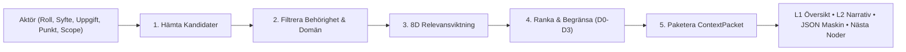
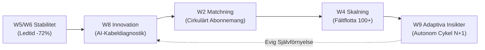

# Masterreferens: Samtliga 7 Avsedda Arbetsflöden (Canonical Workflows)

Denna manual innehåller fullständiga steg-för-steg runbooks och kodexempel för samtliga 7 kanoniska arbetsflöden i `bart`.

---

## Arbetsflöde 1: Dynamisk Kontextupplösning (5-Stegs Pipelinen)

**Syfte**: Omvandla den breda kunskapsgrafen till ett precist, roll- och uppgiftsspecifikt `ContextPacket`.



```python
from src.context_engine.resolver import ContextResolver
from src.core.types import ScopeLevel, PerspectiveWindow

packet = ContextResolver.resolve_context(
    role="Innovationsledare",
    purpose="Pilotera AI-kabeldiagnostik",
    task="Identifiera hårdvaruberoenden och mjukvarukrav",
    scope=ScopeLevel.D1_DIRECT,
    target_entity={"id": "pilot:ai_cable", "name": "AI-Kabelpilot", "domain": "Tools"},
    window=PerspectiveWindow.W8_INNOVATION_TECH,
)
```

---

## Arbetsflöde 2: Den 12-Agentiga Teamoptimeringsloopen

**Syfte**: Sluten problemlösning från empirisk signal till validerat resultat.

Varje agent körs sekventiellt via sitt standardiserade livscykelkontrakt:
1. `ObserverAgent.run(context)`: Bygger en objektiv nulägesbild från telemetrisignaler.
2. `DiagnosticianAgent.run(context)`: Formulerar hypoteser kring rotorsaker och flaskhalsar.
3. `TeamArchitectAgent.run(context)`: Designar nödvändiga struktur- och mandatjusteringar.
4. `Specialister inkallas`:
   - `RoleTransitionAgent`: Vid ansvarsförskjutning.
   - `CollaborationAgent`: Vid verktygs- eller kommunikationsfriktion.
   - `WellbeingAgent`: Vid övertidsbelastning eller stress.
   - `AIEthicsAgent`: Vid automatiska beslut eller biasrisker.
5. `ExperimentAgent.run(context)`: Kapslar in förslaget som ett testbart pilotexperiment.
6. `MeasurementAgent.run(context)`: Mäter nettoeffekt mot baseline ($\Delta \text{metric}$).
7. `LearningAgent.run(context)`: Skapar ett `LearningObject` och uppdaterar organisationens regler.
8. `OrchestratorAgent.run(context)`: Sammanställer nästa steg och synkroniserar loopen.

---

## Arbetsflöde 3: Dubbla Slutna Feedbackloopar

**Syfte**: Säkerställa att både organisationen och agentsystemet lär sig samtidigt.

- **Loop A (Operativ Teamloop)**:
  $$\text{Signal} \longrightarrow \text{Diagnos} \longrightarrow \text{Intervention} \longrightarrow \text{Experiment} \longrightarrow \text{Mätning} \longrightarrow \text{Lärdom} \longrightarrow \text{Ny Signal}$$
- **Loop B (Arkitektonisk Meta-Lärandeloop)**:
  ```python
  from src.agents.meta_learning import MetaLearningAgent

  meta_agent = MetaLearningAgent()
  eval_res = meta_agent.evaluate_system_performance(history, telemetry)
  if eval_res.requires_calibration:
      meta_agent.apply_calibrations(eval_res.updated_weights)
  ```

---

## Arbetsflöde 4: Kontinuerlig Evolutionär Fas-Progression

**Syfte**: Ett konvergerat tillstånd ska aldrig avstanna; frigjord kapacitet styrs automatiskt till nästa fönster.



```python
from src.agents.orchestrator import OrchestratorAgent

# Generera nästa fas automatiskt när föregående fas konvergerat
next_phase = OrchestratorAgent.generate_next_evolutionary_phase(
    current_window=PerspectiveWindow.W8_INNOVATION_TECH,
    previous_outcome={"pilot_status": "VALIDATED"}
)
```

---

## Arbetsflöde 5: Pre-Kognitiv Trajektorieprojektion & Proaktiv Dispatch

**Syfte**: Se framåt längs ERD-grafen, förutsäga färdighetsbehov och förhindra friktion innan den inträffar.

```python
from src.context_engine.precognition import PreCognitiveEngine
from src.core.precognition import ProjectIntent

intent = ProjectIntent(
    intent_id="intent_vmb_q3",
    project_id="PRJ-101",
    mandate="Optimera VMB-marginaler och säkra projekttillstånd före bokslut",
    target_kpis={"gross_margin_boost_pct": 14.2},
    horizon_steps=3,
)

trajectory = PreCognitiveEngine.project_trajectory(
    intent=intent,
    current_node_id="cust_1",
    graph=erd_graph,
    role="CFO"
)

# Proaktiv dispatch av Antigravity-skills:
for skill in trajectory.predicted_skills:
    print(f"PRE-DISPATCH: {skill.skill_name} (Lead time: {skill.lead_time_steps} steg)")
```

---

## Arbetsflöde 6: Självbevarande & SQLite WAL-Återställning

**Syfte**: Atomisk persistens av projekt-, graf- och agenttillstånd med SHA-256 verifiering för noll dataförlust vid processkrascher.

```python
from src.graph.persistence_bridge import GraphPersistenceBridge

bridge = GraphPersistenceBridge()

# 1. Spara checkpoint till SQLite WAL
checkpoint = bridge.save_checkpoint(
    project_id="PRJ-101",
    erd_graph=erd_graph,
    intent=intent,
    agent_states={"OrchestratorAgent": {"last_traj": "traj_01"}}
)

# 2. Vid omstart eller krasch: Återställ med 100% integritet
restored = bridge.restore_checkpoint(project_id="PRJ-101")
active_graph = restored["erd_graph"]
print(f"Återställde {len(active_graph.nodes)} noder med kryptografisk verifiering.")
```

---

## Arbetsflöde 7: The Take — Omniframez Kollektiva Utvecklingsprimitiv

**Syfte**: Strukturera kollektivt tänkande med immutabilitet, förgrening och integration.

```
Conversation → Context → Problem Frame → Cognitive Bottleneck → Evidence → Decision → Action → Outcome → Learning
```

1. **FREEZE TAKE**: Skapar ett oföränderligt ögonblicksdokument med hash-integritet.
2. **BRANCH**: Startar en explorativ utvecklingsgren från ett Take för att undersöka en alternativ hypotes.
3. **MERGE**: Reconcilierar kompatibla insikter från parallella grenar.
4. **REALITY GATE**: Verifierar Decision Readiness (är evidensen tillräcklig för att fatta beslut i den fysiska verkligheten?).
