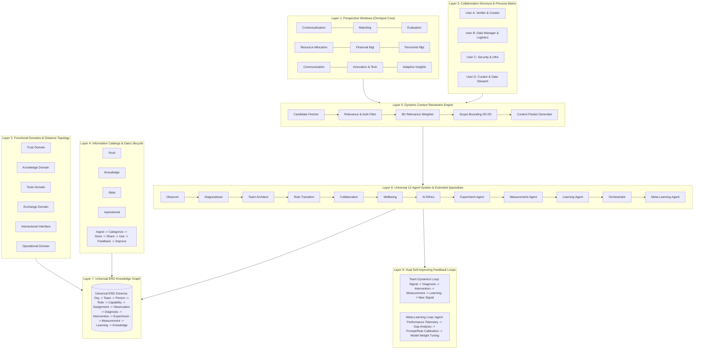

# 01 Feature Specification: Omnipod & Team Dynamics Optimizer

## Executive Summary & Design Vision

The **Omnipod & Team Dynamics Optimizer** is an autonomous, self-improving, multi-agent cognitive architecture built on top of the **Google Antigravity SDK**, **Model Context Protocol (MCP)**, **Dynamic Context Resolution Engine**, and **Universal Entity-Relationship Knowledge Graph (ERD)**.

The framework bridges high-level strategic organizational perspectives with granular operational telemetry. Rather than treating information as static, monolithic text blocks, the system models all data as an **interconnected semantic knowledge graph of discrete entities and typed relationships**.

A core architectural principle of this system is:
> **The Information Graph is broad, rich, and relatively stable. The Context Layer is narrow, dynamic, and task-driven.**

By utilizing dynamic, task-oriented sub-graph extraction, agents and human stakeholders receive precisely calibrated context packets formatted across multiple presentation tiers (Human L1 summary, Human L2 detailed evidence, Machine JSON context packets, and Predictive Next-Node navigation).

---

## Architectural Taxonomy & The 8 Core Layers

The architecture synthesizes the 4 foundational system diagrams and conversational specifications into 8 synchronized layers:



---

## Omnipotent AI Configurations & Protocol Matrix

To ensure omnipotence and resilience, the agent layer is configured according to the **Google Antigravity SDK Protocol Standard**:

1. **Model Backbone**: Defaults to Gemini 3.7 Flash (`gemini-3.7-flash`) with optional Gemini Priority Inference (`service_tier=types.ServiceTier.PRIORITY`) for low-latency operational cycles.
2. **Behavioral Mode**: Agents operate in `AgentBehavior.AUTONOMOUS` mode for closed-loop analysis, transitioning dynamically to `AgentBehavior.INTERACTIVE` when user feedback, confirmation, or stakeholder sign-off is required.
3. **Multi-Agent Hierarchies**: Orchestrated using nested `SubagentConfig` hierarchies with strict `max_subagent_depth` controls and granular `allowed_subagents` allowlists.
4. **Structured Protocol Enforcements**: All agent-to-agent exchanges and tool invocations produce Pydantic-validated JSON payloads (`response_schema`), guaranteeing deterministic contract fulfillment.
5. **Tool & Context Decoupling**: Agents interact with the knowledge graph and external platforms exclusively via **Model Context Protocol (MCP)** servers (`graph_server`, `context_server`, `team_ops_server`).

---

## Standardized Agent Lifecycle: The 6-Function Contract

Every agent in the ecosystem implements the canonical six-function interface:

```python
class StandardAgentLifecycle:
    async def observe(self, context_packet: ContextPacket) -> list[Observation]: ...
    async def analyze(self, observations: list[Observation]) -> AnalysisResult: ...
    async def identify(self, analysis: AnalysisResult) -> list[IdentifiedIssue]: ...
    async def propose(self, issues: list[IdentifiedIssue]) -> list[Proposal]: ...
    async def act(self, proposals: list[Proposal]) -> list[Action]: ...
    async def evaluate(self, actions: list[Action]) -> EvaluationSummary: ...
```

---

## Feature Specifications by Functional Domain

### 1. Dynamic Context Engine
- **Task-Oriented Subgraph Extraction**: Resolves relevant subgraphs given `(Role, Purpose, Task, Current Node, Scope)`.
- **8-Dimensional Weighting**: Computes weighted scores across Task Relevance, Scope Distance, Recency, Role Alignment, Domain Matching, Data Quality, Permissions, and Security/Sensitivity.
- **Dynamic Scope Expansion**: Automatically evaluates stop conditions and supports progressive expansion from `D0` (focal point) to `D1` (direct neighbors), `D2` (extended context), and `D3` (cross-domain systemic context).

### 2. Team Dynamics & Organizational Optimization
- **Signal Aggregation**: Continuously monitors communication velocity, decision turnaround times, role ambiguities, sprint friction, workload distribution, and psychological safety.
- **Root-Cause Diagnostics**: Maps surface symptoms (e.g., "Reporting delay") to structural root causes (e.g., "Data pipeline failure + Unclear decision mandate").
- **Controlled Experimentation**: Automatically generates hypotheses, baseline metrics, test population cohorts, and timeboxes before full-scale rollouts.

### 3. Self-Improving Meta-Learning
- **Agent Performance Auditing**: Evaluates diagnostic accuracy, false positive rates, scope adequacy, and intervention efficacy across loop executions.
- **Adaptive Rule Generation**: Updates routing heuristics, relevance weights, and prompt strategies without human intervention.
