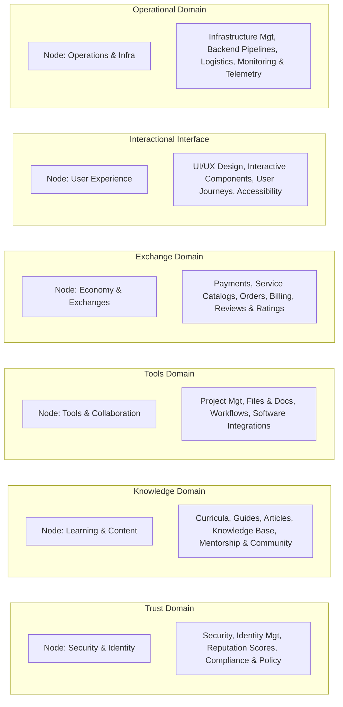
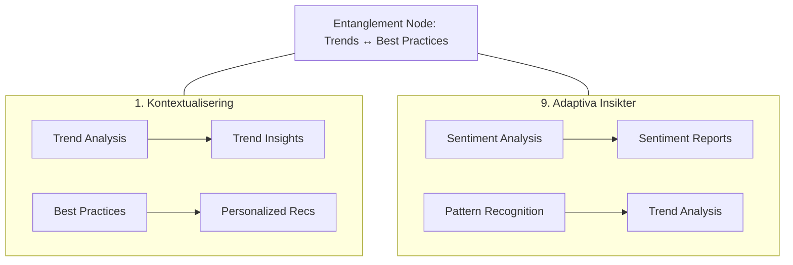

# 02 Omnipod Framework Specification: Windows, Domains, Roles & Catalogs

## 1. Layer 1: Perspective Windows (Omnipod Core)

The Omnipod Framework defines 9 fundamental perspective windows through which organizational and system state is perceived, analyzed, and orchestrated:

| # | Window Name | Primary Objective | Key Capabilities | Primary Output |
|---|-------------|-------------------|------------------|----------------|
| **1** | **Kontextualisering** *(Contextualization)* | Establishes the appropriate frame of reference based on needs, trends, and organizational objectives. | • Context Analysis<br>• Trend Identification<br>• Need Prioritization<br>• Relevance Creation | Relevant insights, environmental trends & opportunity briefs. |
| **2** | **Matchning** *(Matching)* | Matches human capital, digital resources, and organizational opportunities. | • Competence Matching<br>• Need-to-Asset Mapping<br>• Resource Allocation Matching<br>• Availability Balancing | Optimal pairings, assignment recommendations & capacity allocations. |
| **3** | **Utvärdering** *(Evaluation)* | Continuously tracks performance, outcomes, and stakeholder feedback. | • Outcome Measurement<br>• Feedback Analysis<br>• Insight Generation<br>• Improvement Proposals | Structured evaluations, retrospectives & improvement roadmaps. |
| **4** | **Resursallokering** *(Resource Allocation)* | Optimally allocates temporal, monetary, and physical assets across projects. | • Capacity Planning<br>• Asset Distribution<br>• Utilization Monitoring<br>• Throughput Optimization | Resource schedules, allocation plans & capacity forecasts. |
| **5** | **Finansiell hantering** *(Financial Management)* | Budgets, tracks, and audits economic flows, operational expenditures, and compliance. | • Budgeting & Forecasting<br>• Transaction Tracking<br>• Financial Reporting<br>• Regulatory Compliance | Financial overviews, burn-rate metrics & compliance audits. |
| **6** | **Personalhantering** *(Personnel / Human Capital)* | Coordinates teams, role charters, responsibilities, and psychological safety. | • Role & Responsibility Definition<br>• Staffing & Onboarding<br>• Performance Enablement<br>• Wellbeing & Engagement | Organizational charts, role charters & team health scores. |
| **7** | **Kommunikation & Visning** *(Communication & Presentation)* | Serves as the real-time interaction, notification, and visual reporting hub for all stakeholders. | • Real-time Broadcasts<br>• Multi-channel Messaging<br>• Public Engagement<br>• Dynamic Visual Dashboards | Stakeholder updates, alerts & interactive visualization boards. |
| **8** | **Innovation & Teknologi** *(Innovation & Technology)* | Identifies emerging technical solutions, pilots experimental toolchains, and scales innovations. | • Tech Horizon Scanning<br>• Pilot Project Scoping<br>• Implementation Planning<br>• Scaling Frameworks | Tech radar briefs, pilot post-mortems & deployment blueprints. |
| **9** | **Adaptiva Insikter** *(Adaptive Insights)* | Delivers AI-driven sentiment analysis, anomaly detection, early warning signals, and predictive trend vectors. | • Sentiment Analysis<br>• Pattern Recognition<br>• Trend Forecasting<br>• Early Signal Detection | Adaptive insight digests, predictive risks & system recommendations. |

### Core Orchestration Flow
```
Context -> Match -> Plan -> Allocate -> Execute -> Communicate -> Evaluate -> Learn & Adapt
  │                                                                                  │
  └────────────────────────────── Feedback & Steering Loop ──────────────────────────┘
```

---

## 2. Layer 2: Functional Domains & Distance Topology

The platform operates across 6 distinct functional domains. Each domain anchors a specific category of semantic knowledge nodes and behavior:



### Domain Distance Topology & Interplays
In the semantic graph, topological distances govern how context is resolved:
1. **Trust vs. Tools (Max Distance)**: Duality between strict security/access governance and agile productivity/collaboration tool access.
2. **Knowledge vs. Exchange (Max Distance)**: Duality between pedagogical knowledge transfer and commercial financial transaction execution.
3. **Interactional Interface vs. Operational (Max Distance)**: Duality between fluid front-end human experience and deterministic backend infrastructure/data pipelines.

---

## 3. Layer 3: Collaboration Structure & Persona Matrix

Human and AI actors interact with the system through distinct role personas that anchor their access scopes and contribution domains:

| Persona | Core Roles | Domain Contributions | Primary Responsibilities |
|---------|------------|----------------------|--------------------------|
| **User A** | Verifier & Content Creator | • Trust Domain<br>• Knowledge Domain | Verifies identities and credentials; authors, curates, and validates educational and knowledge assets. |
| **User B** | Data Manager & Logistician | • Data Domain<br>• Operational Domain | Oversees data pipeline health, manages ETL processes, structures enterprise datasets, and coordinates logistics. |
| **User C** | Security Expert & Infra Lead | • Trust Domain<br>• Operational Domain | Enforces cryptographic access controls, monitors infrastructure telemetry, and oversees security policy adherence. |
| **User D** | Content Curator & Data Steward | • Knowledge Domain<br>• Data Domain | Curates training curricula, maintains metadata schemas, manages data lineage, and optimizes asset discoverability. |

---

## 4. Layer 4: Information Catalogs & Data Lifecycle

Information is structured into four primary directories:
- `/trust`: Security guidelines, verification logs, audit trails, trust score histories.
- `/knowledge`: Learning pathways, technical documentation, playbooks, community notes.
- `/data`: Operational datasets, schema metadata, analytical metrics, data lineage logs.
- `/operational`: Process runbooks, infrastructure maps, pipeline logs, automated scripts.

### Information Lifecycle Pipeline
```
1. Ingest/Collect -> 2. Categorize -> 3. Store -> 4. Share -> 5. Apply -> 6. Feedback -> 7. Improve
```

### Data Types per Architectural Tier
- **L1 (Perspective Windows)**: Insights, strategic recommendations, roadmaps, escalations, KPIs.
- **L2 (Domains)**: Verified facts, transactions, activities, semantic entities, typed relationships.
- **L3 (Collaboration)**: Roles, permissions, access policies, ownership records, accountability matrices.
- **L4 (Information Layer)**: Structured documents, datasets, telemetry streams, audit logs, media artifacts.

### Governance, Safety & Ethical Principles
- **Data Minimization & Privacy**: Enforce least-privilege context delivery.
- **Explainability & Traceability**: Maintain verifiable provenance chains for all insights.
- **Equitable AI & Bias Mitigation**: Proactively audit algorithmic decisions for disparate impact.
- **Security & Access Control**: Multi-factor cryptographic role-based authorization.
- **Modification Proposal System (MPS)**: Governed change proposals with multi-agent voting and immutable status logs.

---

## 5. Layer 5: Window Particle Decomposition & Entanglement Nodes

Each of the 9 Perspective Windows is decomposed into three structural layers:
1. **Components**: Functional capabilities within the window
2. **Contextual Particles**: Discrete informational units produced by the window
3. **Entanglement Nodes**: Cross-window synchronous update points connecting complementary domains



### Complete Decomposition Registry
- **Kontextualisering**: Trend Analysis (`ctx_trend_insights`), Best Practices Aggregator (`ctx_recommendations`) ↔ Entangled with Adaptiva Insikter.
- **Matchning**: Resource Database (`match_suggestions`), Matching Algorithms (`match_analysis`) ↔ Entangled with Resursallokering.
- **Utvärdering**: Performance Metrics (`eval_reports`), Feedback Integration (`eval_improvements`) ↔ Entangled with Adaptiva Insikter.
- **Resursallokering**: Resource Management (`res_plans`), Optimization Algorithms (`res_forecasts`) ↔ Entangled with Finansiell hantering.
- **Finansiell hantering**: Financial Models (`fin_budget`), Accountability Frameworks (`fin_strategies`) ↔ Entangled with Utvärdering.
- **Personalhantering**: Team Analysis (`pers_charts`), Role Management (`pers_descriptions`) ↔ Entangled with Matchning.
- **Kommunikation & Visning**: Interactive Platforms (`comm_announcements`), Engagement Tools (`comm_metrics`) ↔ Entangled with Adaptiva Insikter.
- **Innovation & Teknologi**: Technology Scouting (`innov_reports`), Innovation Strategies (`innov_plans`) ↔ Entangled with Resursallokering.
- **Adaptiva Insikter**: Sentiment Analysis (`adapt_sentiment_reports`), Pattern Recognition (`adapt_trends`) ↔ Entangled with Kontextualisering.

---

## 6. Layer 6: NavID Hierarchical Navigation Schema

To provide stable cross-layer references across graph nodes, tasks, and documentation, every entity is addressable via a hierarchical NavID:
- Format: `{DOMAIN_PREFIX}-{NodeType}.{SanitizedIdentifier}`
- Standard Prefixes: `TRS` (Trust), `KNW` (Knowledge), `TLS` (Tools), `EXC` (Exchange), `INT` (Interface), `OPS` (Operational), `DAT` (Data).
- Examples: `OPS-Process.DataPipelineZ`, `TRS-Role.SecurityLead`, `DAT-KPI.DecisionTurnaroundTime`.

---

## 7. Layer 7: Platform & Client UI Layer

The platform layer connects the cognitive agent loop to real-time client applications:
1. **LocalStateManager** ([`src/platform/state_manager.py`](file:///k:/50_WORKSPACES/DAVID_GITHUB_MASKINOCHFRITID/bart/src/platform/state_manager.py)): Client-side entity cache with TTL staleness management, LRU eviction, and optimistic updates with instant rollback.
2. **OmnipodUIController** ([`src/platform/ui_controller.py`](file:///k:/50_WORKSPACES/DAVID_GITHUB_MASKINOCHFRITID/bart/src/platform/ui_controller.py)): Manages visibility and batched/debounced component updates for all 9 Omnipod windows.
3. **StreamBridge** ([`src/platform/stream_bridge.py`](file:///k:/50_WORKSPACES/DAVID_GITHUB_MASKINOCHFRITID/bart/src/platform/stream_bridge.py)): Real-time event streaming over WebSocket and Server-Sent Events (SSE).
4. **OmnipodPresenter** ([`src/platform/omnipod_presenter.py`](file:///k:/50_WORKSPACES/DAVID_GITHUB_MASKINOCHFRITID/bart/src/platform/omnipod_presenter.py)): Transforms multi-agent telemetry and graph state into 4-tier client presentation viewmodels.

