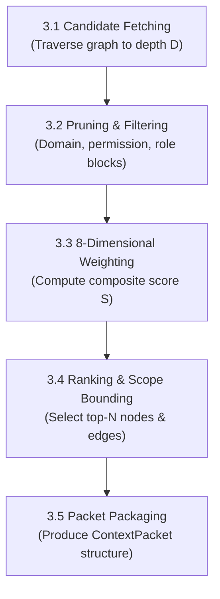
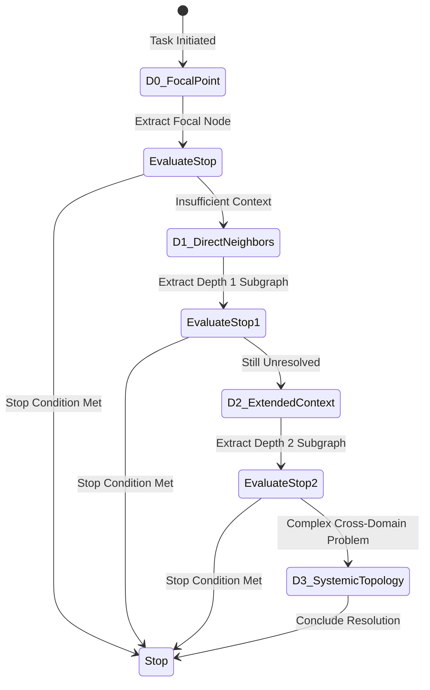

# 03 Dynamic Context Engine Specification: Resolution, Scoping & Context Packets

## 1. Executive Concept

The **Dynamic Context Resolution Engine** acts as an intelligent, task-oriented membrane between the vast semantic knowledge graph and the downstream consumer (whether human or AI agent).

Instead of dumping massive raw text blocks into the LLM prompt window, the engine answers:
> *"What exact subgraph of information is machine-linkable, pertinent, authorized, and sufficient for this specific **Role**, pursuing this **Purpose**, performing this **Task**, anchored at this **Focal Node**, within this **Scope Boundary**?"*

```
     ┌─────────────────────────────────────────────────────────┐
     │                GLOBAL KNOWLEDGE GRAPH                   │
     │      (All Domains, Entities, Relationships & History)   │
     └────────────────────────────┬────────────────────────────┘
                                  │
                                  ▼
     ┌─────────────────────────────────────────────────────────┐
     │            CONTEXT RESOLUTION ENGINE                    │
     │  Inputs: (Role, Purpose, Task, Focal Node, Scope)       │
     │  Pipeline: Fetch -> Filter -> 8D Weight -> Bound -> Pack│
     └────────────────────────────┬────────────────────────────┘
                                  │
                                  ▼
     ┌─────────────────────────────────────────────────────────┐
     │                     CONTEXT PACKET                      │
     │   (Bounded Subgraph + Evidence + Next Nodes + Limits)   │
     └─────────────┬─────────────────────────────┬─────────────┘
                   ▼                             ▼
       ┌──────────────────────┐      ┌──────────────────────┐
       │     HUMAN VIEWS      │      │    MACHINE VIEWS     │
       │ L1: Summary Digest   │      │ L3: JSON Payload     │
       │ L2: Detailed Evidence│      │ L4: Next Node Nav    │
       └──────────────────────┘      └──────────────────────┘
```

---

## 2. Input Specification: The Context Resolution Vector

To trigger context resolution, the client provides a 5-tuple context vector:

```json
{
  "role": "Data Manager",
  "purpose": "Improve Data Quality and Report Delivery",
  "task": "Identify root causes of delayed SLA reporting in pipeline Z",
  "current_point": "node:operational:reporting_sla",
  "scope": {
    "depth": "D1",
    "breadth_limit": 5,
    "max_perspectives": 3,
    "allowed_domains": ["Operational", "Data", "Tools"],
    "time_horizon_days": 90,
    "permission_level": "Team",
    "sensitivity_ceiling": "Standard"
  }
}
```

---

## 3. The 5-Step Resolution Pipeline



### 3.1 Candidate Fetching
Traverses the knowledge graph up to depth $D$ from `current_point` using breadth-first or personalized PageRank search.

### 3.2 Pruning & Filtering
Discards nodes/edges that violate:
- Security permissions (User clearance vs node classification).
- Domain boundary restrictions (`allowed_domains`).
- Obsolete or superseded records outside `time_horizon_days`.

### 3.3 10-Dimensional Relevance Scoring
Every candidate node $i$ receives a normalized composite relevance score $R_i \in [0.0, 1.0]$:

$$R_i = \sum_{k=1}^{10} w_k \cdot f_k(i)$$

Where $\sum w_k = 1.0$ and the 10 dimensions are:
1. **Task Relevance ($f_1$)**: Semantic similarity between task description and node content/metadata.
2. **Scope Distance Proximity ($f_2$)**: Exponential decay with graph distance $d$: $e^{-\lambda d}$.
3. **Recency ($f_3$)**: Temporal decay score based on last update timestamp.
4. **Role Alignment ($f_4$)**: Matrix affinity between user role and node domain/type.
5. **Domain Matching ($f_5$)**: Exact domain match bonus.
6. **Data Quality & Completeness ($f_6$)**: Node verification level and schema validation score.
7. **Permission / Authority ($f_7$)**: Alignment with user authority level.
8. **Sensitivity Balance ($f_8$)**: Penalty for highly sensitive data if not strictly required.
9. **Emotional Tone ($f_9$)**: Heuristic sentiment alignment matching positive operational indicators vs. stress/overload risk signals.
10. **Interaction Phase ($f_{10}$)**: Alignment with the entity's active operational lifecycle phase (onboarding, contribution, mastery, measurement).

### 3.4 Ranking & Scope Bounding
Sorts nodes by $R_i$ and selects the top $N \le \text{breadth\_limit}$.

### 3.5 Packet Packaging
Constructs the final strongly typed `ContextPacket`.

---

## 4. Multi-Tier Presentation Views

The same resolved `ContextPacket` produces 4 distinct presentation formats:

### 4.1 Human Level 1 (Summary Digest)
Concise, human-readable summary for executive decision-makers:
> *"Decision Owner 042 has authority for Decision X. Current decision turnaround is 12 days (target: 5 days). Two dependencies identified: Pipeline Process Y queue delay and Data Pipeline Z failure rate (8%)."*

### 4.2 Human Level 2 (Detailed Evidence)
Deep operational view including metrics, logs, and evidence:
- **Mandate**: Full authority for Decision X.
- **Dependency 1**: Process Y (average queue time: 4.2 days).
- **Dependency 2**: Data Pipeline Z (failure rate: 8%, last 3 incidents logged in `/operational/data_errors`).
- **KPI**: Decision Time = 12 days (benchmark: 5 days).
- **Evidence Count**: 7 supporting telemetry events.

### 4.3 Machine View (Structured JSON Context Packet)
```json
{
  "context_id": "ctx_2026_08_26_8849",
  "target_node": "node:role:decision_owner_042",
  "role": "Data Manager",
  "purpose": "Improve Data Quality",
  "task": "Identify root causes of delayed SLA reporting",
  "scope": {
    "depth": "D1",
    "breadth_limit": 5,
    "allowed_domains": ["Operational", "Data"]
  },
  "nodes": [
    {
      "id": "node:role:decision_owner_042",
      "type": "Role",
      "domain": "Operational",
      "label": "Decision Owner",
      "relevance_score": 1.0
    },
    {
      "id": "node:process:data_pipeline_z",
      "type": "DataPipeline",
      "domain": "Operational",
      "label": "Data Pipeline Z",
      "relevance_score": 0.89
    },
    {
      "id": "node:kpi:decision_time",
      "type": "Metric",
      "domain": "Operational",
      "label": "Decision Time",
      "relevance_score": 0.86
    }
  ],
  "relations": [
    {
      "source": "node:role:decision_owner_042",
      "target": "node:process:data_pipeline_z",
      "type": "DEPENDS_ON",
      "confidence": 0.95
    },
    {
      "source": "node:role:decision_owner_042",
      "target": "node:kpi:decision_time",
      "type": "MEASURED_BY",
      "confidence": 1.0
    }
  ],
  "evidence": [
    {
      "source_ref": "log:pipeline_z:2026_08_25",
      "confidence": 0.94,
      "fact": "Pipeline Z failed 3 times during scheduled morning run."
    }
  ],
  "assumptions": [
    "Decision owner requires completed morning ETL before signing off on daily dispatch."
  ],
  "uncertainties": [
    "Whether upstream ERP export was delayed prior to Pipeline Z ingestion."
  ],
  "recommended_next_nodes": [
    {"node_id": "node:system:erp_export", "relevance": 0.94},
    {"node_id": "node:role:pipeline_maintainer", "relevance": 0.89},
    {"node_id": "node:team:data_engineering", "relevance": 0.76}
  ],
  "stop_condition_met": false
}
```

### 4.4 Navigation View (Predictive Next Node Exploration)
Provides rank-ordered adjacent nodes for progressive discovery:
1. `node:system:erp_export` (Relevance: **0.94**)
2. `node:role:pipeline_maintainer` (Relevance: **0.89**)
3. `node:team:data_engineering` (Relevance: **0.76**)
4. `node:asset:knowledge_etl_guide` (Relevance: **0.41**)
5. `node:finance:compute_cost` (Relevance: **0.18**)

---

## 5. Progressive Scope Expansion (D0 -> D1 -> D2 -> D3)



### Scope Levels:
- **D0 (Point)**: Focal entity itself only.
- **D1 (Direct Neighbors)**: Immediate 1-hop dependencies, responsibilities, owners, metrics.
- **D2 (Extended Cluster)**: 2-hop upstream causes, downstream consumers, related incidents.
- **D3 (Systemic Topology)**: Cross-domain structural links, governance policies, historical patterns.

### Stop Conditions:
1. Question is completely answered with high confidence ($> 0.85$).
2. Sufficient empirical evidence is gathered.
3. Next available nodes drop below minimum relevance threshold ($R < 0.30$).
4. Uncertainty interval is reduced below acceptable tolerance $\epsilon$.
5. Next step explicitly requires transitioning to a different focal point or agent action.
