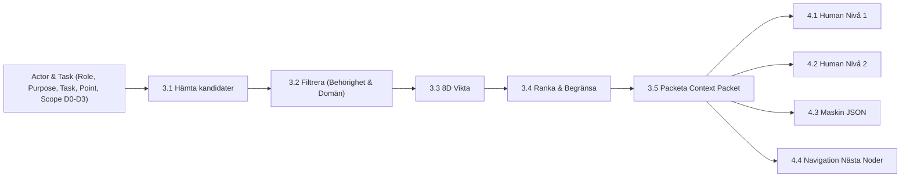

# Dynamic Context Engine & 12-Agent System Specification
**Reference Diagrams**: `Dynamiskt kontextlager_ informationsgraf och lärloop.png`, `Team Dynamics Optimizer_ Adaptivt agentsystem för team.png`

---

## 1. Dynamic Context Resolution Engine (5-Step Pipeline)

### The 8 Weighting Dimensions
1. **Relevans mot uppgift** (Task Relevance) [0.0 - 1.0]
2. **Närhet** (`scope_distance` in hops) [D0=1.0, D1=0.8, D2=0.5, D3=0.2]
3. **Aktualitet** (Recency decay) [0.0 - 1.0]
4. **Roll-relevans** (Match against role permissions & focus) [0.0 - 1.0]
5. **Domänmatchning** (Domain compatibility) [0.0 - 1.0]
6. **Datakvalitet** (Quality & veracity score) [0.0 - 1.0]
7. **Behörighet** (Access level match) [0.0 - 1.0]
8. **Säkerhet / känslighet** (Sensitivity filter) [0.0 - 1.0]

### Scope Expansion Logic
- **D0 (Immediate)**: Target node only (0 hops).
- **D1 (Direct)**: 1-hop direct neighbors, immediate contracts.
- **D2 (Systemic)**: 2-hop subsystem context, financial ledger, policies.
- **D3 (Expanded)**: 3-hop macro organization, external authorities, Skatteverket, meta-learning loop.
- **Stop Condition**: Sufficient evidence gathered, confidence >= threshold, or budget exhausted.

---

## 2. The Universal 12-Agent System Loop

| # | Agent | Key Function | Input | Primary Output | Question Answered |
|---|---|---|---|---|---|
| 1 | **Observer** | Collects signals, telemetry, and feedback | Raw logs, POS, Fortnox, events | Objective Nulägesbild & Signaler | *Vad händer i teamet just nu?* |
| 2 | **Diagnostiker** | Analyzes patterns, bottlenecks & root causes | Nulägesbild | Hypoteser & rotorsaker | *Varför händer det?* |
| 3 | **Team Architect** | Designs optimal team structure & mandates | Diagnos | Strukturförslag & scenarier | *Hur bör teamet vara utformat?* |
| 4 | **Role Transition** | Plans & executes smooth role migrations | Strukturförslag | Övergångsplan & kommunikation | *Hur tar vi oss från nuläge till önskat läge?* |
| 5 | **Collaboration** | Optimizes workflows, communication & tools | Teamstruktur | Samarbetsinterventioner | *Hur kan vi samarbeta bättre?* |
| 6 | **Wellbeing** | Tracks friction, workload & mental sustainability | Team-signaler, timmar | Välmående-åtgärder & stöd | *Hur mår teamet och vad behöver de?* |
| 7 | **AI Ethics** | Audits AI usage, bias, privacy & safety | Processer, modeller | Risker, safeguards & guardrails | *Är vår AI-användning etisk och säker?* |
| 8 | **Meta-Learning** | Self-improves the multi-agent system itself | All agent telemetry, gap analysis | Systemförbättringar & nya förmågor | *Hur kan själva systemet bli bättre?* |
| 9 | **Measurement** | Quantifies intervention impact & KPIs | Experiment, nya data | Mätresultat & KPI-effektstorlek | *Vad blev resultatet?* |
| 10 | **Learning** | Extracts durable organizational knowledge & rules | Mätresultat | Lärdomar & uppdaterade regler | *Vad lärde vi oss?* |
| 11 | **Orchestrator** | Master scheduler determining next agent to activate | Alla agentresultat | Nästa actions & prioriteringar | *Vad ska göras härnäst och i vilken ordning?* |
| 12 | **Experiment Agent** | Converts proposed interventions to testable experiments | Åtgärdsförslag | Experimentplan & testpopulation | *Hur testar vi detta på ett säkert sätt?* |

---

## 3. Declarations of Future Integration Points

- #TODO [Continuous Online Reinforcement for Meta-Learning](file:///c:/Users/info/OneDrive/Dokument/GitHub/bart/src/agents/meta_learning.py#L95): Integrate online contextual bandits for automated dynamic re-weighting of agent dispatch thresholds.
- #TODO [Automated Synthetic Scenario Generator](file:///c:/Users/info/OneDrive/Dokument/GitHub/bart/src/agents/experiment_agent.py#L110): Generate generative Monte Carlo organizational scenarios to stress-test team transitions before human deployment.
