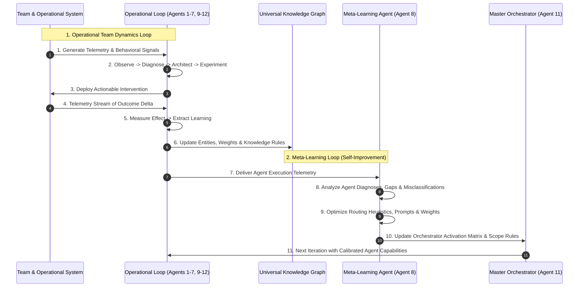

# 04 Agent Loop & Meta-Learning Specification: Core Agents, Specialists & Dual Loops

## 1. System Agent Ecosystem

The agent ecosystem comprises **13 Core Team Dynamics Agents** and **8 Extended Information Specialists** working in concerted synchronization, coordinated by the `TeamDynamicsOrchestrator` and mediated by the `ActionDispatcher`.

```mermaid
graph TD
    subgraph ORCH["Orchestration & Context Layer"]
        Orchestrator[11. Orchestrator]
        ContextResolver[Context Resolver (10D Scoring)]
        ScopeManager[Scope Manager (D0..D3)]
        Governance[Governance & MPS]
        Dispatcher[Dual-Path Action Dispatcher]
    end

    subgraph DISCOVER["Discovery & Semantic Modeling"]
        Observer[1. Observer]
        InsightIntegration[2a. Insight Integration Agent]
        InsightSynthesizer[2b. Insight Synthesizer Agent]
        SemanticMapper[Semantic Mapper]
        RelationshipAnalyst[Relationship Analyst]
        Provenance[Provenance & Evidence]
    end

    subgraph DIAG["Diagnosis & Architecture"]
        Diagnostician[2. Diagnostiker]
        TeamArchitect[3. Team Architect]
        RoleTransition[4. Role Transition]
        DecisionArchitect[Decision Architect]
    end

    subgraph DOMAIN_AGENTS["Domain & Well-being Interventions"]
        Collaboration[5. Collaboration]
        Wellbeing[6. Wellbeing]
        AIEthics[7. AI Ethics]
        ActionExecution[Action / Execution]
    end

    subgraph EVAL_LEARN["Experimentation, Measurement & Learning"]
        ExperimentAgent[12. Experiment Agent]
        MeasurementAgent[9. Measurement Agent]
        LearningAgent[10. Learning Agent]
    end

    subgraph META["Meta-Learning & System Optimization"]
        MetaLearning[8. Meta-Learning Agent]
    end

    Orchestrator --> ContextResolver
    ContextResolver --> ScopeManager
    ScopeManager --> Observer
    Observer --> InsightIntegration
    InsightIntegration --> InsightSynthesizer
    InsightSynthesizer --> Diagnostician
    Diagnostician --> TeamArchitect
    TeamArchitect --> RoleTransition
    RoleTransition --> Collaboration
    Collaboration --> Wellbeing
    Wellbeing --> AIEthics
    AIEthics --> ExperimentAgent
    ExperimentAgent --> MeasurementAgent
    MeasurementAgent --> LearningAgent
    LearningAgent --> MetaLearning
    MetaLearning -->|Calibrated Weights| ContextResolver
```
    Wellbeing --> ExperimentAgent
    AIEthics --> ExperimentAgent
    ExperimentAgent --> ActionExecution
    ActionExecution --> MeasurementAgent
    MeasurementAgent --> LearningAgent
    LearningAgent --> MetaLearning
    MetaLearning -.-> Orchestrator
```

---

## 2. Agent Catalog & Responsibilities

### The 12 Core Agents

| # | Agent Name | Core Responsibility | Input | Primary Output |
|---|------------|---------------------|-------|----------------|
| **1** | **Observer** | Gathers telemetry, behavioral signals, sprint logs, feedback, and objective context. | Raw team data, events, metrics | `Nulägesbild & Signaler` (Baseline status & signals) |
| **2** | **Diagnostiker** | Analyzes patterns, detects bottlenecks, isolates root causes, and generates hypotheses. | Baseline signals & observations | `Hypoteser & Rotorsaker` (Root causes & hypotheses) |
| **3** | **Team Architect** | Designs optimal team topology, role charters, authority matrices, and structural scenarios. | Diagnosis & constraints | `Strukturförslag & Scenarier` (Structural designs) |
| **4** | **Role Transition Agent** | Plans, coordinates, and manages seamless role and responsibility handovers. | Structural blueprint & change needs | `Övergångsplan & Kommunikation` (Transition plans) |
| **5** | **Collaboration Agent** | Optimizes cross-functional workflows, meeting cadences, and tooling interactions. | Team structure & friction points | `Samarbetsinterventioner` (Collaboration interventions) |
| **6** | **Wellbeing Agent** | Monitors cognitive load, burnout risks, friction, and promotes psychological safety. | Stress signals, workload metrics | `Välmåendeåtgärder` (Preventive wellbeing actions) |
| **7** | **AI Ethics Agent** | Audits algorithmic decision-making, bias, data minimization, and ethical safeguards. | AI pipelines & decision logs | `Risker & Safeguards` (Ethical guardrails) |
| **8** | **Meta-Learning Agent** | Analyzes the performance of the agent system itself, optimizing heuristics and prompts. | System telemetry, audit logs | `Systemförbättringar & Regler` (System optimizations) |
| **9** | **Measurement Agent** | Quantifies outcome impact, calculating delta improvements against pre-intervention baselines. | Experiment telemetry & KPIs | `Mätresultat & KPI-analys` (Impact & delta metrics) |
| **10** | **Learning Agent** | Extracts generalizable organizational principles, updating the core knowledge base. | Measurement analyses & outcomes | `Lärdomar & Uppdaterade Regler` (Learnings & rules) |
| **11** | **Orchestrator** | Evaluates system state, selects next active agents, manages priority queues and triggers. | All agent results | `Nästa actions & Prioriteringar` (Next execution steps) |
| **12** | **Experiment Agent** | Converts proposed structural interventions into rigorous, falsifiable hypothesis experiments. | Action proposals & targets | `Experimentplan` (Testable experiment plans) |

### The 8 Extended Information Specialists

| Specialist Name | Purpose | Output Artifact |
|-----------------|---------|-----------------|
| **Context Resolver** | Extracts task-specific subgraphs from the knowledge base. | `ContextPacket` |
| **Scope Manager** | Bounds search depth (D0-D3), breadth, time horizon, and domain access. | `ScopeContract` |
| **Semantic Mapper** | Translates natural language concepts into strongly typed graph entities and edges. | `SemanticMapping` |
| **Provenance & Evidence Agent** | Maintains verifiable attribution chains from raw data to final insight. | `EvidenceChain` |
| **Relationship Analyst** | Detects latent multi-hop dependencies, conflicts, and synergy links. | `RelationalSubgraph` |
| **Decision Architect** | Converts analytical insights into structured, multi-criteria decision matrices. | `DecisionObject` |
| **Action / Execution Agent** | Translates decisions into actionable task tickets and operational workflows. | `ActionObject` |
| **Governance Agent** | Enforces privacy policies, regulatory compliance, access controls, and transparency. | `GovernancePolicy` |

---

## 3. Standardized Agent Contracts

### 3.1 The Canonical `AgentResult` Contract
Every agent returns the standardized `AgentResult` schema:

```json
{
  "agent_name": "Diagnostiker",
  "iteration_id": "iter_2026_08_26_01",
  "observations": [
    "Average decision turnaround for daily release signoff is 12 days."
  ],
  "confidence": 0.88,
  "identified_issues": [
    {
      "issue_id": "issue_001",
      "severity": "HIGH",
      "description": "Decision Owner 042 is blocked waiting on Pipeline Z completion."
    }
  ],
  "hypotheses": [
    {
      "hypothesis_id": "hypo_001",
      "statement": "Pipeline Z failure rate of 8% causes decision owner to postpone signoff.",
      "probability": 0.85
    }
  ],
  "recommendations": [
    "Refactor Pipeline Z retry logic and clarify temporary delegation authority."
  ],
  "actions": [
    {
      "action_id": "act_001",
      "type": "TASK",
      "assignee": "Data Engineering",
      "description": "Implement automated idempotency for Pipeline Z."
    }
  ],
  "metrics": {
    "decision_time_days": 12.0,
    "pipeline_z_failure_rate": 0.08
  },
  "risks": [
    "Temporary delegation without training may lead to erroneous signoffs."
  ],
  "dependencies": [
    "node:process:data_pipeline_z",
    "node:role:decision_owner_042"
  ],
  "next_questions": [
    "What is the average duration of Pipeline Z manual recovery?"
  ]
}
```

---

## 4. The Dual Self-Improving Loop Architecture



### 4.1 Loop 1: Operational Team Dynamics Loop
$$\text{Signal} \longrightarrow \text{Diagnosis} \longrightarrow \text{Intervention} \longrightarrow \text{Measurement} \longrightarrow \text{Learning} \longrightarrow \text{New Signal}$$

### 4.2 Loop 2: Meta-Learning Agent Loop
Evaluates:
- **Diagnostic Efficacy**: Did the diagnosed root cause validate during experimentation?
- **Intervention ROI**: Did proposed changes improve target KPIs without unintended side-effects?
- **Agent Redundancy**: Are any agents producing overlapping or contradictory recommendations?
- **Scope Precision**: Were D0/D1/D2 bounds sufficient, or did queries frequently require manual expansion?

Produces:
- `AgentPerformanceModel`: Accuracy, latency, token economy, and user acceptance rates per agent.
- `ActivationRules`: Updated threshold triggers (e.g., lower `role_confusion` threshold from 0.70 to 0.55).
- `RelevanceWeights`: Fine-tuned dimensional weights $w_1 \dots w_8$ for the Context Resolution Engine.
