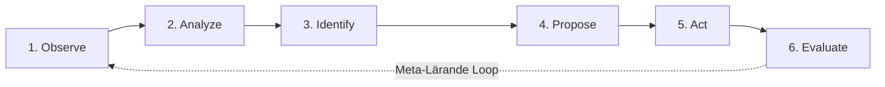
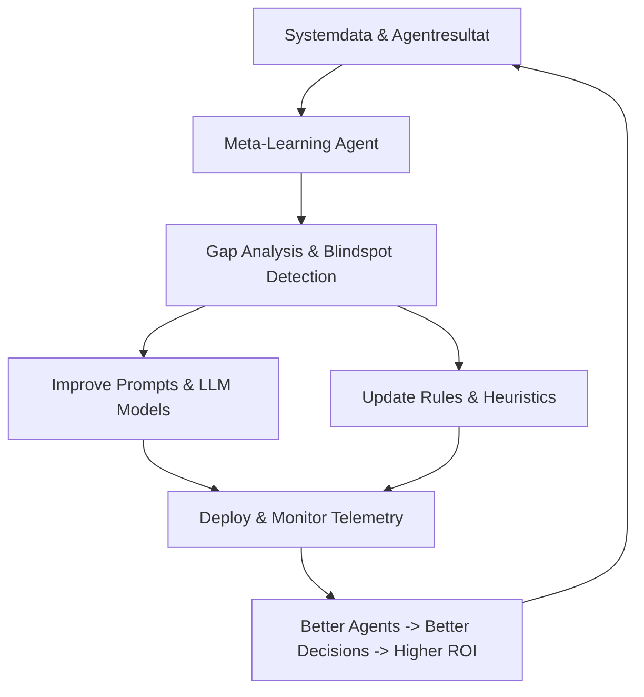

# 04: Team Dynamics 12-Agent Closed Loop Architecture Specification

Denna specifikation formaliserar arkitekturen och livscykeln för de 12 autonoma agenterna baserat på **Team Dynamics Optimizer: Adaptivt agentsystem för team** och **Självförbättrande teamoptimering i ERD-loop**.

---

## 1. Agentöversikt & 6-Stegs Livscykel

Varje agent ärver från [`BaseAgent`](file:///c:/Users/info/OneDrive/Dokument/GitHub/bart/src/agents/base.py) och exekverar följande standardiserade cykel:

### De 12 Autonoma Agenterna i Loopen:

| # | Agent | Kärnfråga | Output | Källkod |
|---|-------|-----------|--------|---------|
| 1 | **Observer** | *Vad händer i teamet just nu?* | Nulägesbild & signaler | [`ObserverAgent`](file:///c:/Users/info/OneDrive/Dokument/GitHub/bart/src/agents/observer.py) |
| 2 | **Diagnostiker** | *Varför händer det?* | Hypoteser & rotorsaker | [`DiagnosticianAgent`](file:///c:/Users/info/OneDrive/Dokument/GitHub/bart/src/agents/diagnostician.py) |
| 3 | **Team Architect** | *Hur bör teamet vara utformat?* | Strukturförslag & scenarier | [`TeamArchitectAgent`](file:///c:/Users/info/OneDrive/Dokument/GitHub/bart/src/agents/team_architect.py) |
| 4 | **Role Transition** | *Hur tar vi oss från nu till önskat läge?* | Övergångsplan & kommunikation | [`RoleTransitionAgent`](file:///c:/Users/info/OneDrive/Dokument/GitHub/bart/src/agents/role_transition.py) |
| 5 | **Collaboration** | *Hur kan vi samarbeta bättre?* | Samarbetsinterventioner | [`CollaborationAgent`](file:///c:/Users/info/OneDrive/Dokument/GitHub/bart/src/agents/collaboration.py) |
| 6 | **Wellbeing** | *Hur mår teamet och vad behöver de?* | Välmående-åtgärder & stöd | [`WellbeingAgent`](file:///c:/Users/info/OneDrive/Dokument/GitHub/bart/src/agents/wellbeing.py) |
| 7 | **AI Ethics** | *Är vår AI-användning etisk och säker?* | Risker, safeguards & guardrails | [`AIEthicsAgent`](file:///c:/Users/info/OneDrive/Dokument/GitHub/bart/src/agents/ai_ethics.py) |
| 8 | **Experiment Agent** | *Hur testar vi detta på ett säkert sätt?* | Experimentplan & piloter | [`ExperimentAgent`](file:///c:/Users/info/OneDrive/Dokument/GitHub/bart/src/agents/experiment_agent.py) |
| 9 | **Measurement** | *Vad blev resultatet?* | Mätresultat & KPI:er | [`MeasurementAgent`](file:///c:/Users/info/OneDrive/Dokument/GitHub/bart/src/agents/measurement.py) |
| 10 | **Learning** | *Vad lärde vi oss?* | Lärdomar & regler | [`LearningAgent`](file:///c:/Users/info/OneDrive/Dokument/GitHub/bart/src/agents/learning.py) |
| 11 | **Orchestrator** | *Vad ska göras härnäst och i vilken ordning?* | Nästa actions & prioriteringar | [`OrchestratorAgent`](file:///c:/Users/info/OneDrive/Dokument/GitHub/bart/src/agents/orchestrator.py) |
| 12 | **Meta-Learning** | *Hur kan själva systemet bli bättre?* | Systemförbättringar & heuristik | [`MetaLearningAgent`](file:///c:/Users/info/OneDrive/Dokument/GitHub/bart/src/agents/meta_learning.py) |

---

## 2. Meta-Learning Förbättringsloop

---

## 3. Framtida Utökningar (#TODO)

- `#TODO`: [Real-time Slack/Teams WebSocket connector for ObserverAgent](file:///c:/Users/info/OneDrive/Dokument/GitHub/bart/src/agents/observer.py#L22)
- `#TODO`: [LLM-driven dynamic role negotiation prompts in RoleTransitionAgent](file:///c:/Users/info/OneDrive/Dokument/GitHub/bart/src/agents/role_transition.py#L30)
- `#TODO`: [Bayesian Multi-Armed Bandit pilot allocation in ExperimentAgent](file:///c:/Users/info/OneDrive/Dokument/GitHub/bart/src/agents/experiment_agent.py#L35)
- `#TODO`: [Vector embedding store for semantic pattern lookup in LearningAgent](file:///c:/Users/info/OneDrive/Dokument/GitHub/bart/src/agents/learning.py#L25)
