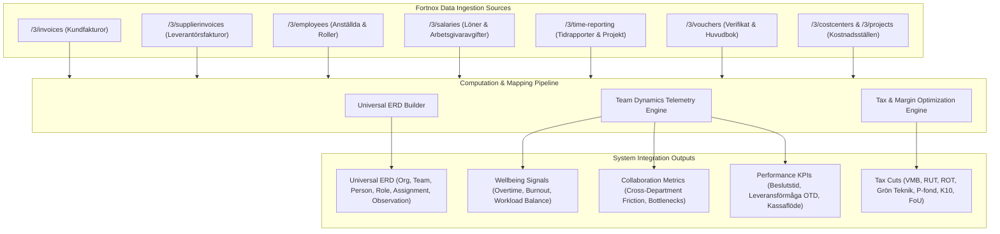

# Fortnox Data Computation & Integration Specification
**Reference Diagrams**: All 4 Diagrams (`Team Dynamics Optimizer`, `Självförbättrande teamoptimering i ERD-loop`, `Omnipod Framework`, `Dynamiskt kontextlager`)

---

## 1. Comprehension: How Fortnox Data Maps into the Omnipod & Team Dynamics Architecture

Fortnox provides a rich ERP/financial stream for Swedish businesses. Rather than merely treating Fortnox as accounting software, our architecture uses Fortnox as an **objective behavioral telemetry source** feeding the 12 agents, the Universal ERD, and the 9 Perspective Windows:

### 1.1 Mapping Fortnox Entities to Universal ERD
1. **Fortnox Employees (`/3/employees`)** → `Person` entities.
   - `EmployeeId` → `person_id`
   - `FirstName` + `LastName` → `name`
   - `JobTitle` → `role_title`
   - `MonthlySalary` → feeds K10 owner dividend & FoU R&D salary calculation.
2. **Fortnox Projects & Cost Centers (`/3/projects`, `/3/costcenters`)** → `Team` & `Role` entities.
   - `ProjectCode` / `CostCenter` → `team_id` / `Team`
   - `ProjectLeader` → `Role` (mandat & ansvar)
3. **Fortnox Time Reports (`/3/time-reporting`)** → `Assignment` & `Observation` entities.
   - `Hours` worked per employee per project → `Assignment.allocation_pct`.
   - Overtime hours (`Övertid`) > 15 hrs/week → Triggers `Observation` with domain `Operational` / `Trust` for the **Wellbeing Agent**.
4. **Fortnox Customer Invoices (`/3/invoices`)** → `Observation` & `Transaction` entities.
   - Invoiced items, customer types, SNI codes → Feeds **Tax Optimization Agent** and **W2 Matching / W5 Financial Management**.
   - Payment delay (Due Date vs Paid Date) → Computes **Decision Delay** and customer friction.
5. **Fortnox Vouchers (`/3/vouchers`)** → `Measurement` & `Ledger` entities.
   - Account balances on 1930 (Bank), 2610-2650 (Moms), 3000-3051 (Intäkter) → Verifies double entry and financial integrity.

### 1.2 Team Dynamics Metrics Computed from Fortnox Data
- **Team Health Index (0–100)**: Computed as weighted average of workload balance (from timesheets), turnover stability (from employee churn), and revenue per FTE.
- **Belastningsbalans / Workload Balance (0–100)**: Variance of logged hours across team members. High variance = bottleneck in individual key players.
- **Beslutstid (Genomsnitt Dagar)**: Mean cycle time from order creation to invoice issuance and settlement.
- **Leveransförmåga (OTD %)**: Ratio of project hours delivered on schedule vs overdue timecards.
- **Samarbetseffektivitet (0–100)**: Ratio of productive project hours vs administrative rework logged in Fortnox.

---

## 2. Declarations of Future Integration Points

- #TODO [Fortnox Live OAuth2 Production Webhook](file:///c:/Users/info/OneDrive/Dokument/GitHub/bart/src/fortnox/client.py#L40): Implement live OAuth2 PKCE handshake with refresh token rotation and real-time webhook listeners for invoice & timesheet events.
- #TODO [Bi-directional Automatic Fortnox Voucher Posting](file:///c:/Users/info/OneDrive/Dokument/GitHub/bart/src/fortnox/client.py#L125): Post approved tax adjustment vouchers directly to Fortnox API `/3/vouchers` in production environment with idempotency tokens.
