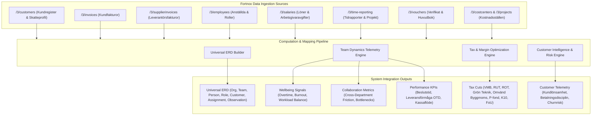

# Fortnox Data Computation & Integration Specification
**Reference Diagrams**: All 4 Diagrams (`Team Dynamics Optimizer`, `Självförbättrande teamoptimering i ERD-loop`, `Omnipod Framework`, `Dynamiskt kontextlager`)

---

## 1. Comprehension: How Fortnox Data Maps into the Omnipod & Team Dynamics Architecture

Fortnox provides a rich ERP/financial stream for Swedish businesses. Rather than merely treating Fortnox as accounting software, our architecture uses Fortnox as an **objective behavioral telemetry source** feeding the 12 agents, the Universal ERD, and the 9 Perspective Windows:

### 1.1 Mapping Fortnox Entities to Universal ERD

1. **Fortnox Customers (`/3/customers`)** → `Organization` (B2B) / `Person` (B2C) & `CustomerTaxProfile` entities.
   - `CustomerNumber` → `party_id` / `customer_id`
   - `Name` + `OrganisationNumber` → `OrganizationEntity` (om `Type == "COMPANY"`) eller `PersonEntity` (om `Type == "PRIVATE"`).
   - `VATType` (`SEVAT`, `SEREVERSEDVAT`, `EUVAT`, `EXPORT`) & `SNI-kod` → Klassificerar omvänd skattskyldighet för byggsektorn (ML 1 kap. 2 § / SNI 41-43) och exportregler.
   - `RUT/ROT-behörighet` (Personnummer, Fastighetsbeteckning/BRF-orgnr) → Styr **Tax Optimization Agent** vid RUT-avdragsberäkning (50% arbetskostnad upp till 75 000 SEK/person/år).
   - `TermsOfPayment` & `CreditLimit` → Etablerar kreditriskramverk och likviditetstelemetri för **W5 Financial Management**.

2. **Fortnox Employees (`/3/employees`)** → `Person` entities.
   - `EmployeeId` → `person_id`
   - `FirstName` + `LastName` → `name`
   - `JobTitle` → `role_title`
   - `MonthlySalary` → feeds K10 owner dividend & FoU R&D salary calculation.

3. **Fortnox Projects & Cost Centers (`/3/projects`, `/3/costcenters`)** → `Team` & `Role` entities.
   - `ProjectCode` / `CostCenter` → `team_id` / `Team`
   - `ProjectLeader` → `Role` (mandat & ansvar)

4. **Fortnox Time Reports (`/3/time-reporting`)** → `Assignment` & `Observation` entities.
   - `Hours` worked per employee per project → `Assignment.allocation_pct`.
   - Overtime hours (`Övertid`) > 15 hrs/week → Triggers `Observation` with domain `Operational` / `Trust` for the **Wellbeing Agent**.

5. **Fortnox Customer Invoices (`/3/invoices`)** → `Observation` & `Transaction` entities.
   - Invoiced items, customer types, SNI codes → Feeds **Tax Optimization Agent** och **W2 Matching / W5 Financial Management**.
   - Payment delay (Due Date vs Paid Date) → Computes **Decision Delay**, betalningsdisciplin och kundfriktion.
   - Fakturarader med inbyten/begagnat kopplas automatiskt till **VMB Marginalbeskattning (ML 9a kap)**.

6. **Fortnox Vouchers (`/3/vouchers`)** → `Measurement` & `Ledger` entities.
   - Account balances on 1930 (Bank), 2610-2650 (Moms), 3000-3051 (Intäkter) → Verifies double entry and financial integrity.

### 1.2 Telemetry Metrics Computed from Fortnox Data

#### A. Team Dynamics & Verksamhetsmått
- **Team Health Index (0–100)**: Vägda medelvärdet av belastningsbalans (från tidrapporter), personalomsättningsstabilitet, och omsättning per anställd (FTE).
- **Belastningsbalans / Workload Balance (0–100)**: Varians i loggade timmar över teammedlemmar. Låg spridning = hög balans, eliminerar personberoenden.
- **Beslutstid (Genomsnitt Dagar)**: Genomsnittlig ledtid från orderregistrering till fakturering och slutlikvid.
- **Leveransförmåga (OTD %)**: Andel projektleveranser och fältuppdrag slutförda i tid utan övertidsforcering.
- **Samarbetseffektivitet (0–100)**: Kvot mellan produktiv debiterbar projekttid och administrativt merarbete.

#### B. Kundtelemetri & Skatteoptimering per Kund
- **Kundlönsamhet & Bruttomarginal (SEK & %)**: Aggregerad nettoomsättning minus direkta material- och underleverantörskostnader per kund.
- **Betalningsdisciplin & Kreditsignal (Dagar)**: Faktiskt betaldatum minus förfallodatum ($D_{\text{paid}} - D_{\text{due}}$). Negativt = förtida betalning, positivt = likviditetsrisk/kundfriktion.
- **Skatteoptimeringspotential per Kund (SEK)**: Identifierad skattereduktion genom automatisk omklassificering:
  - *B2C Villaägare*: RUT 50% skattereduktion på arbetskostnad (BAS 3002 / Skv Fält 05).
  - *B2C Begagnatköpare*: VMB 20% vinstmarginalbeskattning (BAS 3051/2611 istället för 25% på hela brutto).
  - *B2B Bygg & Entreprenad*: Omvänd byggmoms (ML 1 kap. 2 § / BAS 3045 / Skv Fält 41).
- **Kundfriktionsindex (0–100)**: Mått baserat på kreditnotor, reklamationer, försenade betalningar och tidrapporterat merarbete kopplat till kundens projekt.

---

## 2. Declarations of Future Integration Points

- #TODO [Fortnox Live OAuth2 Production Webhook](file:///c:/Users/info/OneDrive/Dokument/GitHub/bart/src/fortnox/client.py#L40): Implement live OAuth2 PKCE handshake with refresh token rotation and real-time webhook listeners for invoice, customer & timesheet events.
- #TODO [Bi-directional Automatic Fortnox Voucher Posting](file:///c:/Users/info/OneDrive/Dokument/GitHub/bart/src/fortnox/client.py#L125): Post approved tax adjustment vouchers directly to Fortnox API `/3/vouchers` in production environment with idempotency tokens.
- #TODO [Bi-directional Fortnox Customer Master Data Sync](file:///c:/Users/info/OneDrive/Dokument/GitHub/bart/src/fortnox/client.py#L180): Real-time enrichment of Fortnox Customer Master `/3/customers` with computed tax profiles (RUT/ROT, Omvänd moms, VMB status), risk ratings, and preferred payment terms.

