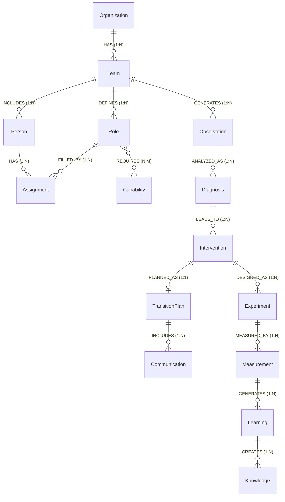

# 05 Universal ERD & Knowledge Graph Specification: Entities, Relations & Cardinalities

## 1. Universal ERD Architecture

The Universal ERD models all organizational entities, roles, telemetry, diagnoses, interventions, experiments, metrics, learnings, and knowledge artifacts as a unified, strongly typed relational and graph structure:

---

## 2. Entity Schemas & Cardinality Catalog

### 2.1 Context Entities

#### `Organization`
Represents the enterprise or operational umbrella.
- `organization_id` (PK, string, UUID)
- `name` (string)
- `industry` (string)
- `size` (string: "SMALL", "MEDIUM", "ENTERPRISE")
- `region` (string)
- `created_at` (datetime)

#### `Team`
Represents a cross-functional squad, department, or operational unit.
- `team_id` (PK, string, UUID)
- `organization_id` (FK -> Organization.organization_id)
- `name` (string)
- `purpose` (string)
- `type` (string: "CROSS_FUNCTIONAL", "FUNCTIONAL", "PLATFORM", "TASK_FORCE")
- `created_at` (datetime)

---

### 2.2 People, Roles & Capabilities

#### `Person`
Represents an individual team member or contributor.
- `person_id` (PK, string, UUID)
- `team_id` (FK -> Team.team_id)
- `name` (string)
- `role_title` (string)
- `seniority` (string: "JUNIOR", "MID", "SENIOR", "LEAD", "PRINCIPAL")
- `employment_type` (string: "FULL_TIME", "CONTRACTOR", "PART_TIME")
- `created_at` (datetime)

#### `Role`
Defines a functional responsibility archetype within a team.
- `role_id` (PK, string, UUID)
- `team_id` (FK -> Team.team_id)
- `role_name` (string)
- `purpose` (string)
- `responsibilities` (list[string])
- `decision_rights` (list[string])
- `created_at` (datetime)

#### `Capability`
A discrete technical, domain, or behavioral competency.
- `capability_id` (PK, string, UUID)
- `name` (string)
- `description` (string)
- `category` (string: "TECHNICAL", "DOMAIN", "LEADERSHIP", "PROCESS")
- `created_at` (datetime)

#### `Assignment`
Associates a person with a role over a defined time horizon and capacity fraction.
- `assignment_id` (PK, string, UUID)
- `person_id` (FK -> Person.person_id)
- `role_id` (FK -> Role.role_id)
- `start_date` (date)
- `end_date` (date, optional)
- `allocation_pct` (float, 0.0 - 100.0)
- `created_at` (datetime)

---

### 2.3 Observation & Analysis Entities

#### `Observation`
Raw or aggregated telemetry signal captured by the Observer agent.
- `observation_id` (PK, string, UUID)
- `team_id` (FK -> Team.team_id)
- `source_type` (string: "JIRA", "SLACK", "GIT", "HRIS", "SURVEY", "TELEMETRY")
- `source_ref` (string, URI or log identifier)
- `observed_at` (datetime)
- `data_json` (dict, raw telemetry payload)
- `created_by_agent_id` (string: "Observer")

#### `Diagnosis`
Root cause analysis and hypothesis generated by the Diagnostician.
- `diagnosis_id` (PK, string, UUID)
- `observation_id` (FK -> Observation.observation_id)
- `hypothesis` (string)
- `root_cause` (string)
- `confidence` (float, 0.0 - 1.0)
- `created_by_agent_id` (string: "Diagnostiker")
- `created_at` (datetime)

---

### 2.4 Planning, Design & Intervention Entities

#### `Intervention`
Proposed organizational, procedural, or technical change.
- `intervention_id` (PK, string, UUID)
- `type` (string: "ROLE_CHANGE", "PROCESS_OPTIMIZATION", "TOOLING", "WELLBEING_POLICY")
- `description` (string)
- `status` (string: "PROPOSED", "APPROVED", "IN_EXPERIMENT", "DEPLOYED", "REJECTED")
- `proposed_by_agent_id` (string)
- `created_at` (datetime)

#### `TransitionPlan`
Step-by-step roadmap for executing a role or organizational transition.
- `transition_plan_id` (PK, string, UUID)
- `intervention_id` (FK -> Intervention.intervention_id)
- `from_state_json` (dict)
- `to_state_json` (dict)
- `steps_json` (list[dict])
- `timeline` (string)
- `owner_id` (FK -> Person.person_id)
- `status` (string: "DRAFT", "ACTIVE", "COMPLETED")

#### `Communication`
Broadcast or direct notification delivering change messaging to stakeholders.
- `communication_id` (PK, string, UUID)
- `transition_plan_id` (FK -> TransitionPlan.transition_plan_id)
- `audience` (string)
- `message` (string)
- `channel` (string: "SLACK", "EMAIL", "IN_APP", "TOWN_HALL")
- `sent_at` (datetime, optional)
- `created_by` (string)

---

### 2.5 Experimentation & Measurement Entities

#### `Experiment`
Structured, hypothesis-driven test to validate an intervention before wide deployment.
- `experiment_id` (PK, string, UUID)
- `intervention_id` (FK -> Intervention.intervention_id)
- `hypothesis` (string)
- `design` (dict: control_group, test_group, duration, guardrails)
- `start_date` (date)
- `end_date` (date)
- `status` (string: "SCHEDULED", "RUNNING", "CONCLUDED", "ABORTED")

#### `Measurement`
Empirical metric readings collected to evaluate experiment impact.
- `measurement_id` (PK, string, UUID)
- `experiment_id` (FK -> Experiment.experiment_id)
- `metric_name` (string)
- `value_number` (float, optional)
- `value_text` (string, optional)
- `baseline_value` (float, optional)
- `delta_pct` (float, optional)
- `measured_at` (datetime)

---

### 2.6 Learning & Knowledge Entities

#### `Learning`
Validated organizational takeaway derived from measured outcomes.
- `learning_id` (PK, string, UUID)
- `measurement_id` (FK -> Measurement.measurement_id)
- `insight` (string)
- `impact` (string: "HIGH", "MEDIUM", "LOW")
- `confidence` (float, 0.0 - 1.0)
- `created_at` (datetime)

#### `Knowledge`
Codified institutional knowledge node stored in the primary knowledge graph.
- `knowledge_id` (PK, string, UUID)
- `type` (string: "PRINCIPLE", "POLICY", "HEURISTIC", "ANTIPATTERN", "PLAYBOOK")
- `content` (string)
- `tags` (list[string])
- `source_learning_id` (FK -> Learning.learning_id, optional)
- `created_at` (datetime)
