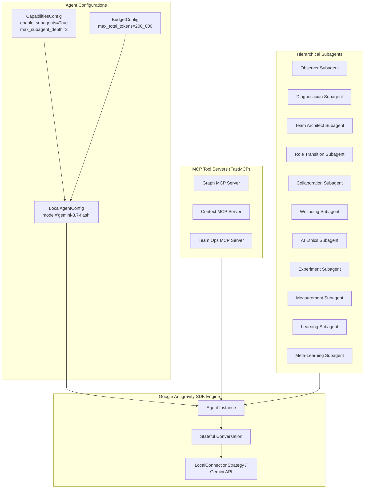

# 06 Google Antigravity SDK Architecture Specification

## 1. Google Antigravity SDK Integration Overview

The Omnipod & Team Dynamics Optimizer leverages the official **Google Antigravity (AGY) SDK** to orchestrate all autonomous multi-agent interactions, subagent delegations, tool calls, and model inferences.



---

## 2. Model & Endpoint Configuration

- **Default Foundation Model**: `gemini-3.7-flash` is used across all cognitive reasoning, diagnostics, and structured synthesis tasks.
- **Visual Synthesis**: `gemini-3.1-flash-lite-image` is used for generating UI diagrams and organizational charts if requested.
- **Prioritized Inference**: For mission-critical real-time operational loops, requests utilize `types.ServiceTier.PRIORITY` via `GeminiModelOptions`.

```python
from google.antigravity import Agent, LocalAgentConfig, types

config = LocalAgentConfig(
    model="gemini-3.7-flash",
    capabilities=types.CapabilitiesConfig(
        agent_behavior=types.AgentBehavior.AUTONOMOUS,
        enable_subagents=True,
        max_subagent_depth=3,
        allowed_subagents=[
            "observer", "diagnostician", "team_architect",
            "role_transition", "collaboration", "wellbeing",
            "ai_ethics", "experiment_agent", "measurement_agent",
            "learning_agent", "meta_learning_agent"
        ],
    ),
    budget_config=types.BudgetConfig(
        max_model_calls=50,
        max_tool_calls=100,
        max_total_tokens=500_000,
    ),
)
```

---

## 3. Hierarchical Subagent Orchestration

The Master Orchestrator delegates tasks to specialized subagents according to a strict multi-tier hierarchy:

```python
from google.antigravity import types

def build_subagent_configs() -> list[types.SubagentConfig]:
    return [
        types.SubagentConfig(
            name="observer",
            description="Collects and normalizes team signals, sprint metrics, and context.",
            capabilities=types.SubagentCapabilities(
                agent_behavior=types.AgentBehavior.AUTONOMOUS,
                enabled_tools=[types.BuiltinTools.VIEW_FILE],
            ),
        ),
        types.SubagentConfig(
            name="diagnostician",
            description="Analyzes telemetry to isolate bottlenecks and formulate root-cause hypotheses.",
            capabilities=types.SubagentCapabilities(
                agent_behavior=types.AgentBehavior.AUTONOMOUS,
                enabled_tools=[types.BuiltinTools.VIEW_FILE],
            ),
        ),
        types.SubagentConfig(
            name="team_architect",
            description="Designs organizational topologies, role charters, and mandate boundaries.",
            capabilities=types.SubagentCapabilities(
                agent_behavior=types.AgentBehavior.AUTONOMOUS,
            ),
        ),
        types.SubagentConfig(
            name="experiment_agent",
            description="Transforms intervention recommendations into testable experiment plans.",
            capabilities=types.SubagentCapabilities(
                agent_behavior=types.AgentBehavior.AUTONOMOUS,
            ),
        ),
        types.SubagentConfig(
            name="meta_learning_agent",
            description="Audits agent efficacy, detects blind spots, and tunes heuristic weights.",
            capabilities=types.SubagentCapabilities(
                agent_behavior=types.AgentBehavior.AUTONOMOUS,
            ),
        ),
    ]
```

---

## 4. Model Context Protocol (MCP) Server Architecture

Agents query the knowledge graph and context engine via three dedicated FastMCP servers:

1. **`graph_server`**:
   - `get_entity(entity_id: str) -> dict`
   - `search_nodes(query: str, domain: str, limit: int) -> list[dict]`
   - `get_relationships(entity_id: str, direction: str) -> list[dict]`
   - `add_entity(entity_type: str, data: dict) -> str`
   - `add_relationship(source: str, target: str, rel_type: str) -> bool`

2. **`context_server`**:
   - `resolve_context(role: str, purpose: str, task: str, current_node: str, depth: str) -> dict`
   - `expand_scope(context_id: str, target_depth: str) -> dict`
   - `get_presentation_view(context_id: str, tier: str) -> str | dict`

3. **`team_ops_server`**:
   - `fetch_team_telemetry(team_id: str, time_window_days: int) -> dict`
   - `log_diagnosis(observation_id: str, hypothesis: str, root_cause: str) -> str`
   - `register_experiment(intervention_id: str, experiment_plan: dict) -> str`
   - `record_measurement(experiment_id: str, metric_name: str, value: float) -> str`
   - `publish_learning(measurement_id: str, insight: str, confidence: float) -> str`

---

## 5. Deterministic Contracts via Structured Outputs

All agent communications produce strictly validated Pydantic models via `response_schema` and `response.structured_output()`:

```python
from google.antigravity import Agent, LocalAgentConfig
from src.core.contracts import AgentResult

async def execute_agent_turn(agent_config: LocalAgentConfig, prompt: str) -> AgentResult:
    # Enforce Pydantic schema validation on model output
    config = agent_config.copy(update={"response_schema": AgentResult})
    async with Agent(config=config) as agent:
        response = await agent.chat(prompt)
        result_dict = await response.structured_output()
        return AgentResult.model_validate(result_dict)
```
