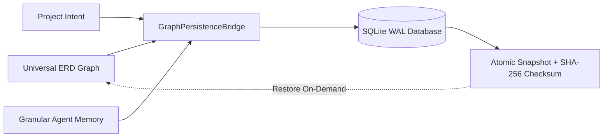
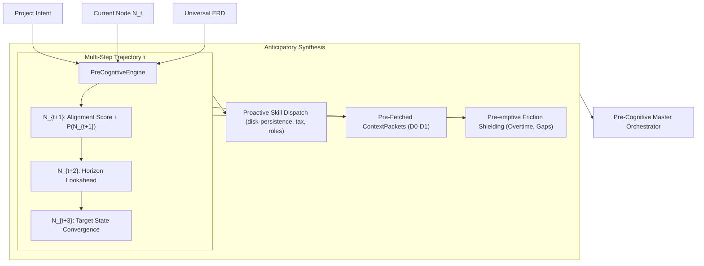

# 06: Self-Preservation & Intentional Contextual Pre-Cognition Specification
**Reference Diagrams**: `Dynamiskt kontextlager_ informationsgraf och lärloop.png`, `Omnipod Framework_ Lager, Domäner och Flöden.png`

---

## 1. Executive Summary & Problem Statement

Standard autonomous agent systems suffer from two core failure modes:
1. **Amnesia & Process Fragility (Lack of Self-Preservation)**: Agent state, knowledge graph mutations, and REPL variables are lost across process boundaries, container crashes, or IDE reloads.
2. **Pure Reactivity (Lack of Pre-Cognition)**: Agents merely react to errors, user queries, or threshold alerts after bottlenecks have already degraded system performance.

This specification formalizes **Self-Preservation** (durable SQLite WAL state snapshots & cross-session rehydration) and **Intentional Contextual Pre-Cognition** (goal-directed trajectory projection, proactive skill dispatch, and pre-emptive friction shielding).

---

## 2. Self-Preservation Architecture (GraphPersistenceBridge)

Self-preservation is implemented through [`GraphPersistenceBridge`](file:///c:/Users/info/OneDrive/Dokument/GitHub/bart/src/graph/persistence_bridge.py), adhering to the durable persistence design pattern established in the `disk-persistence` skill:

### 2.1 State Snapshot Schema
Every checkpoint serialized to `.antigravity/storage/projects/project_persistence.db` guarantees:
- **`checkpoint_id`**: Deterministic unique identifier `chk_{project_id}_{timestamp}`.
- **`node_count` & `edge_count`**: Relational entity telemetry.
- **`erd_snapshot_json`**: Full Universal ERD topology with typed nodes and directional edges.
- **`agent_states_json`**: Persistent agent memory states.
- **`checksum_sha256`**: Cryptographic hash verifying tamper-proof rehydration.

---

## 3. Intentional Contextual Pre-Cognition Pipeline

Rather than unstructured prompting, workflows operate against an explicit [`ProjectIntent`](file:///c:/Users/info/OneDrive/Dokument/GitHub/bart/src/core/precognition.py):

$$\text{Intent} = \langle \text{Mandate}, \text{DesiredState}, \text{TargetKPIs}, \text{Constraints}, \text{HorizonSteps} \rangle$$

### 3.1 Mathematical Trajectory Projection
Transition probability from node $N_t$ to candidate neighbor $N_{cand}$ is defined as:

$$P(N_{cand} \mid N_t, \text{Intent}) = \sigma \left( \alpha \cdot \text{Match}(\text{words}(N_{cand}), \text{mandate}) + \beta \cdot \mathbb{I}(\text{domain}(N_{cand}) \in \text{AllowedDomains}) + \gamma \cdot \text{RelWeight}(N_t, N_{cand}) \right)$$

Where:
- $\alpha = 0.35$ (lexical semantic alignment).
- $\beta = 0.15$ (domain containment bonus).
- $\gamma = 0.50$ (graph edge relational weight).

### 3.2 Pre-Cognitive Skill Dispatch Matrix
| Anticipated Requirement | Pre-Cognitive Trigger | Dispatched Skill | Tools Suggested |
| :--- | :--- | :--- | :--- |
| **State Checkpointing** | Multi-step transitions ($\ge 2$ steps), session branches | `disk-persistence` | `persist_sandbox`, `manage_snapshot`, `restore_sandbox_disk` |
| **Financial / Tax Audit** | Invoiced labor, used goods, SNI 41-43, year-end profit | `tax-optimization` | `audit_financial_stream`, `evaluate_tax_rule`, `create_vmb_sale_voucher` |
| **Structural Re-alignment** | Decision rights change, role ambiguity, team split | `role-transition` | `create_transition_plan`, `assess_role_overlap`, `dispatch_comm` |
| **Workload Imbalance** | Overtime hours $> 15$ hrs/week, high task spread | `wellbeing-agent` | `rebalance_assignments`, `trigger_workload_alert` |
| **Batch Automation** | Repetitive scheduled syncs, ERP telemetry polling | `worker-orchestration` | `spawn_worker`, `inspect_worker_health` |

---

## 4. API Endpoints for UI & Agent Dispatch

1. **`POST /api/precognition/predict`**: Computes multi-step trajectory, predicted skills, pre-fetched context packets, and anticipated friction for a given project intent.
2. **`POST /api/project/checkpoint`**: Saves a durable checkpoint of the current Universal ERD and agent memories into SQLite WAL.
3. **`GET /api/project/checkpoints?project_id=...`**: Lists historical checkpoints with integrity checksums.
4. **`POST /api/project/restore`**: Rehydrates Universal ERD and intent from a selected checkpoint.
